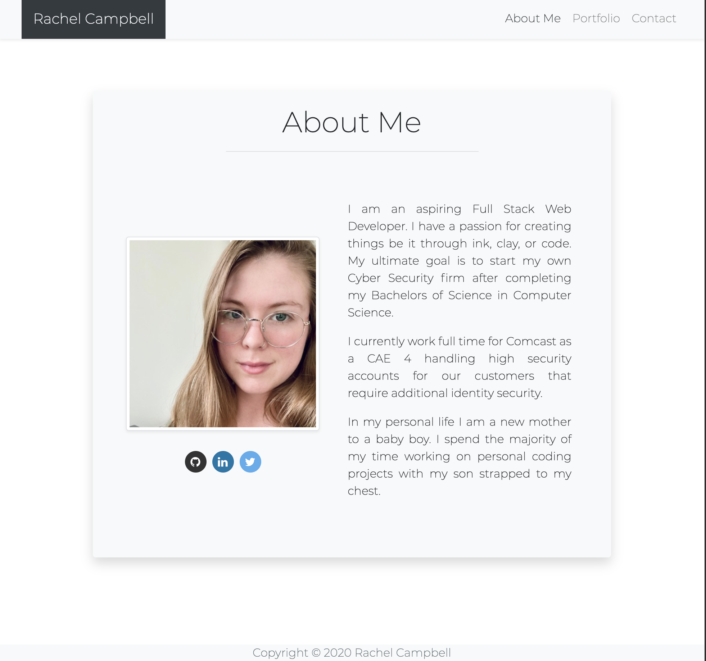
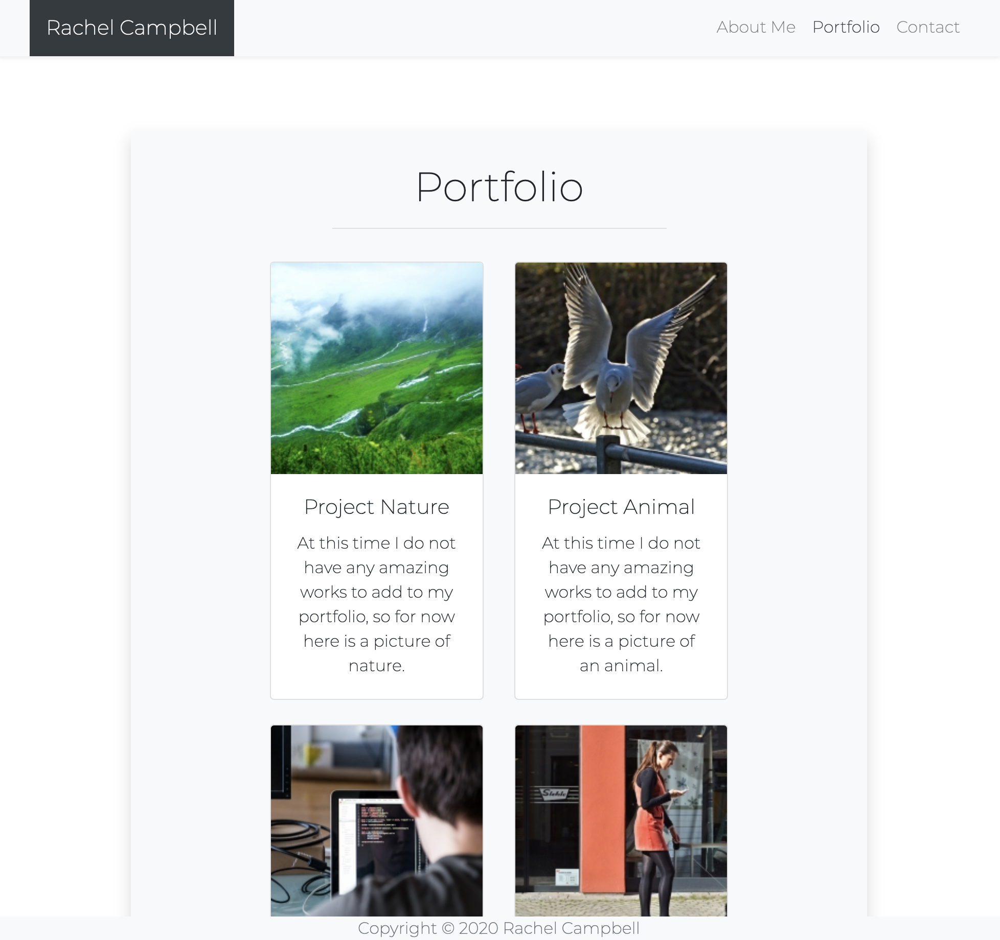
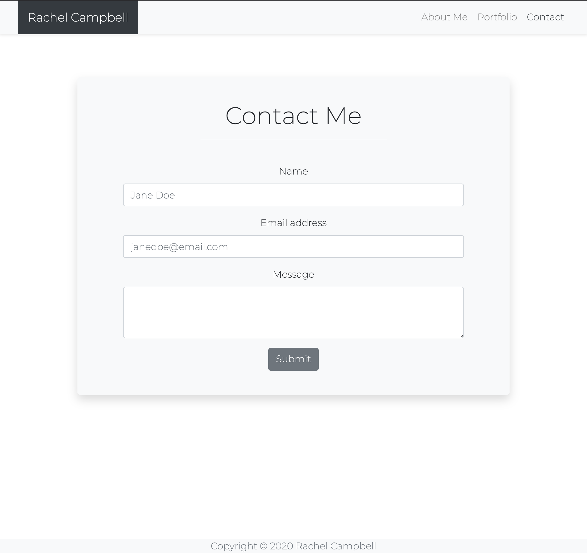
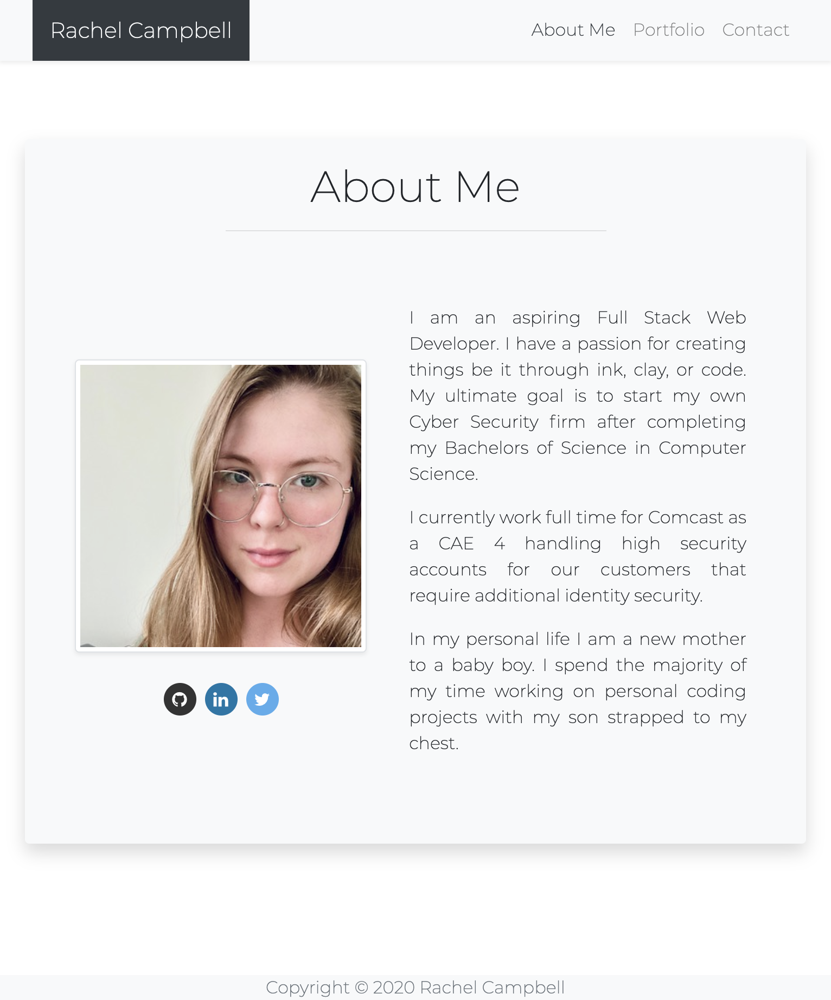
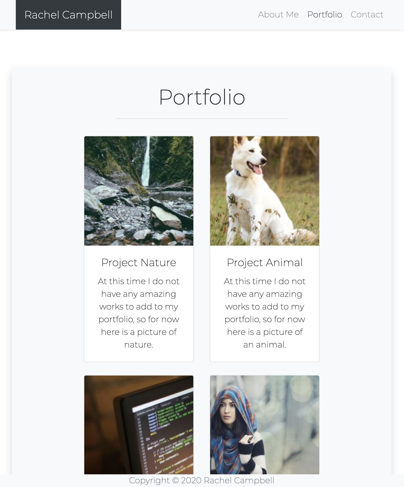
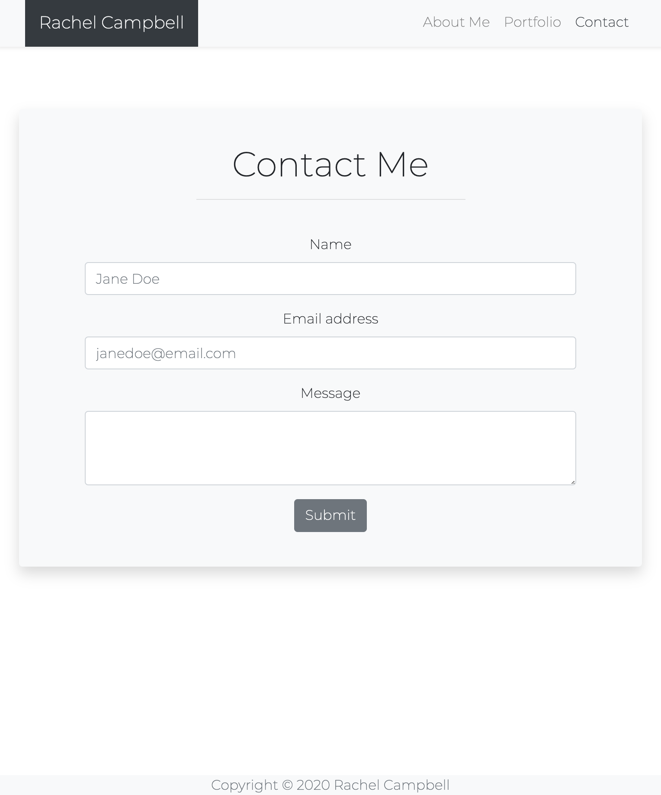
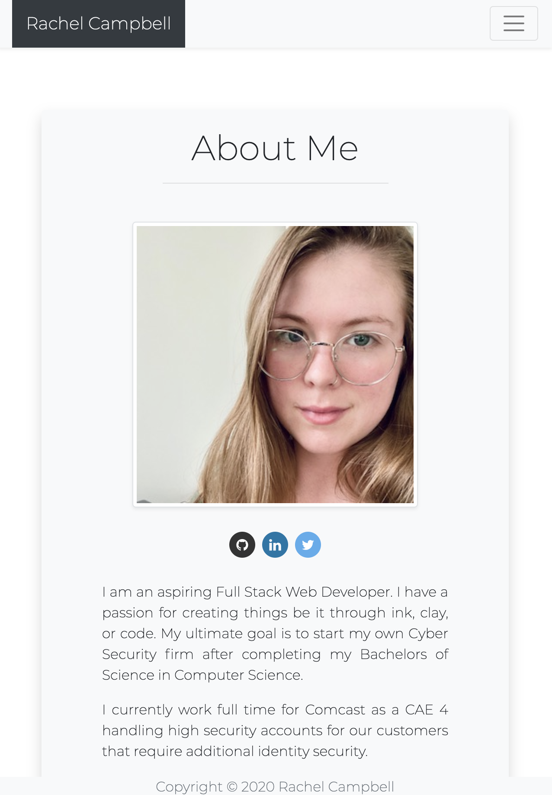
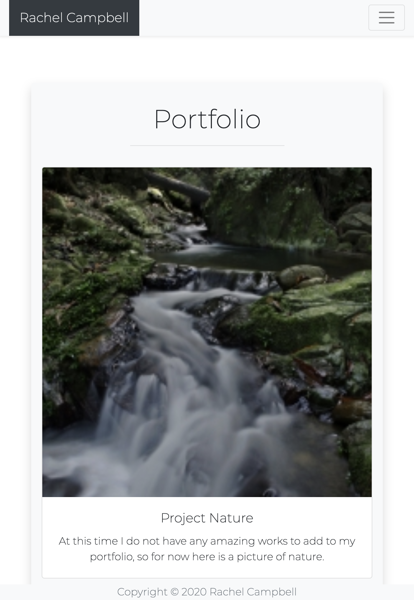
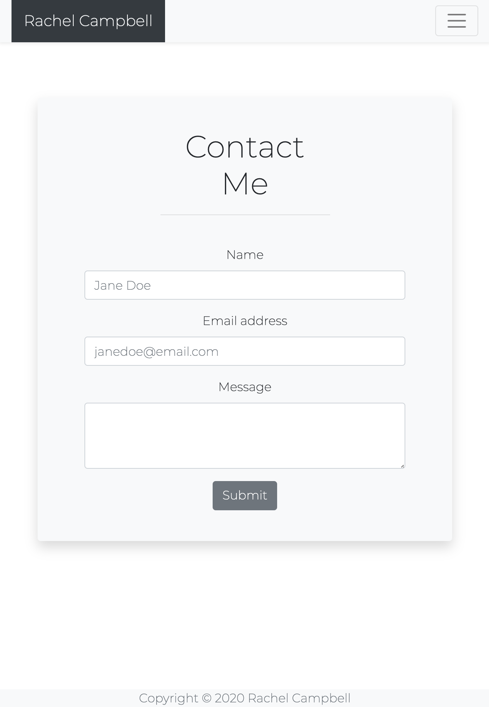

# Personal Portfolio

The goal of this project was to design a personal portfolio that is tailored to me.

## Getting Started

All that is required to run this is to follow this link to view in github pages:

## Built With

- [HTML5](https://www.w3.org/TR/html52/) - The markup language used
- [Bootstrap 4, Bootstrap 4 JS, Bootstrap 4 JQuery](https://getbootstrap.com/docs/4.5/getting-started/introduction/) - CSS Framework used

## Screenshots

640

## Authors

- **Rachel Campbell** - _complete work_ - [relizabet](https://github.com/relizabet)

## License

This project is licensed under the MIT License - see the [LICENSE.md](LICENSE.md) file for details

## Acknowledgments

- Bootstrap developers
- My instructors
